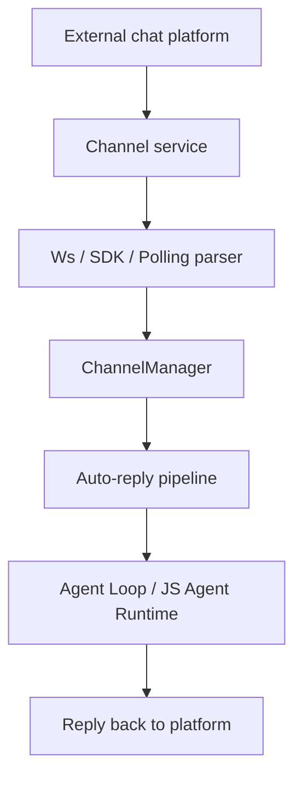

# 插件系统概述 / Plugin System Overview

消息平台插件让 OpenCowork 能把外部聊天流接到本地 Agent。它们不是 app plugin；它们是**真正的消息接入层**。

## 架构 / Architecture



## 核心组件 / Core components

| 组件 | 作用 |
| --- | --- |
| `ChannelManager` | 管理插件生命周期 |
| `BasePluginService` | 插件服务基类 |
| `ChannelProviderDescriptor` | 描述某个平台需要什么配置和工具 |
| `plugin-tools.ts` | 给 Agent 暴露统一的消息平台工具 |
| `auto-reply.ts` | 收到消息后的自动回复流水线 |

## 当前支持的平台 / Supported platforms

| 平台 | 描述 |
| --- | --- |
| Feishu Bot | Lark / 飞书，支持流式卡片 |
| DingTalk Bot | 钉钉 Stream API |
| WeCom Bot | 企业微信 |
| QQ Bot | QQ 官方 Gateway WS |
| Weixin Official | 个人微信扫码绑定 / 官方网关接入 |
| Telegram Bot | Telegram bot + relay |
| Discord Bot | Discord gateway WS |
| WhatsApp Bot | WhatsApp Cloud API + relay |

## 插件工具 / Plugin tools

所有平台共享一组统一工具：

- `PluginSendMessage`
- `PluginReplyMessage`
- `PluginGetGroupMessages`
- `PluginListGroups`
- `PluginSummarizeGroup`
- `PluginGetCurrentChatMessages`

Feishu 和 Weixin 还有专属媒体工具，例如图片、文件、成员列表、@成员、紧急消息等。

## 持久化 / Persistence

插件实例会保存在：

```text
~/.open-cowork/plugins.json
```

每个实例会记录：

- 类型
- 是否启用
- 是否自动启动
- 工具开关
- 连接配置

## 自动回复 / Auto reply

当消息进来时，插件会把事件交给自动回复管线。然后：

1. 把消息转成统一格式
2. 生成或恢复 session
3. 让 Agent Loop 处理
4. 把结果发回平台

## 安全提醒 / Safety note

插件能把 Agent 接到真实聊天环境里，所以它们通常比本地 UI 更危险：

- 它们会直接暴露外部用户消息
- 它们会用到 forceApproval / 自动回复逻辑
- 它们的工具开关要谨慎配置

如果你只想增强本地 Agent 能力，请看 [应用插件](/docs/features/app-plugins)。
